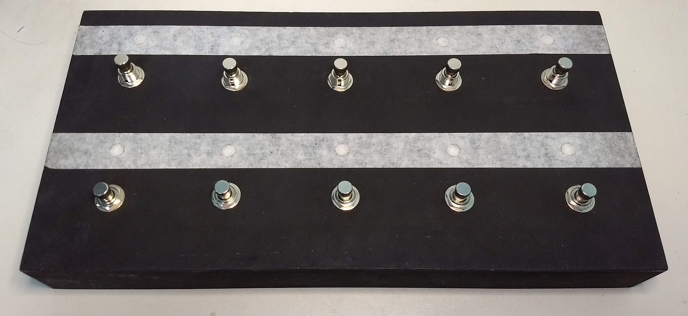
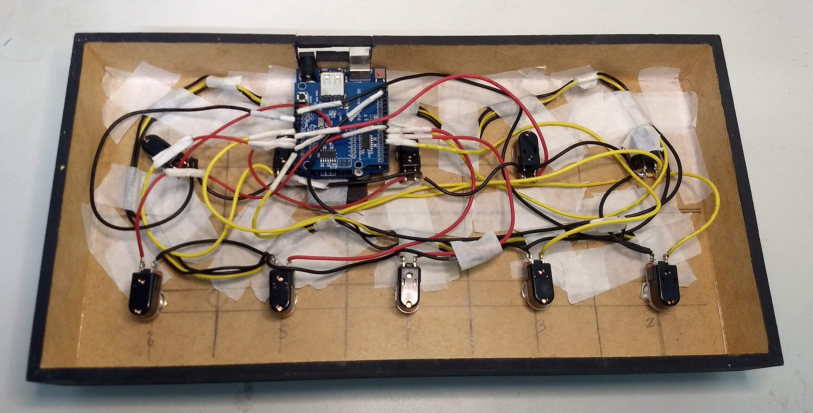

# Controlador Midi Arduino Para Pedaleira ZOOM G3 - Cod.1
# CÓDIGO 1 - 10 Presets Bank UP e Down
Controlador com <b>10 Pedais</b> para acessar <b>10 Patches</b>. 
O Pedal <b>5</b> também tem a função de <b>Bank Down</b> se pressionado por 1 segundo. 
O Pedal <b>10</b> também tem a função de <b>Bank Up</b> se pressionado por 1 segundo. 
Usei LEDs programáveis, pela opção de poder usar os 10 em uma única porta Digital do Arduíno, pois com LEDs comuns não daria pra realizar o projeto no UNO. 
 
<b>LISTA DE MATERIAIS:</b> 
1 Arduíno UNO 
1 Placa Host Shield USB 
10 Chaves Momentâneas 
10 LEDs endereçáveis 
Fios usei de Fonte de PC 
Caixa de Madeira comprada em Loja de Artesanato, com as medidas: 
36cm de largura, 18cm profundidade e 4,5cm de altura. 
 
Usei solda Cobix e ferro de solda da Hikari, é muito bom usar solda e um ferro de boa qualidade. 
Todo o esquema de ligação das chaves e leds estão bem detalhadas nas imagens.
 

<a href="https://youtu.be/XyXns0vm2Yk"><b> ** VÍDEO DE DEMONSTRAÇÃO DO FUNCIONAMENTO ** </b></a>

 

 
 

 
 

 
 

